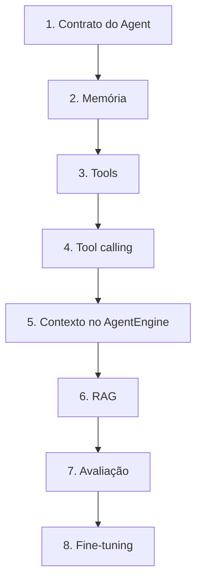

# Roadmap do Agent (plataforma)

Ordem de evolução recomendada — cada fase desbloqueia a seguinte. O MVP atual cobre **chat + prompt + histórico opcional no request**; o restante está esboçado no código ou planejado aqui.



Legenda de status: **feito** | **parcial** | **pendente**

---

## 1. Definir o contrato do Agent

**Objetivo:** Deixar explícito o que entra e sai de cada turno, quem é o ator (tenant, usuário) e como o assistente se comporta — sem depender do formato interno do Ollama.

### Contrato HTTP (já existe no MVP)

| Item | Estado | Onde |
|------|--------|------|
| `POST /api/agent/chat` | feito | `AgentController`, `AgentChatRequest` / `AgentChatResponse` |
| `assistant` (ID do assistente) | feito | `AssistantType` |
| `message` | feito | validação no request |
| `history` opcional `[{role, content}]` | feito | repassado ao `AgentEngine` |
| `GET /api/agent/status` | feito | diagnóstico plataforma + LLM |
| Resposta única `message` (sem tools expostas ainda) | feito | sem streaming, sem `tool_calls` na API |

### Contrato de domínio (parcial)

| Item | Estado | Onde |
|------|--------|------|
| `AgentContext` (user, phone, permissions) | parcial | single-tenant (sem `tenantId`); `AgentService` só preenche `assistant` |
| `Assistant` (tipo, nome, prompt, model override) | feito | `AssistantService` |
| Prompt base + especializado | feito | `PromptComposer` + `base-system.txt` + `horas-extras-system.txt` |
| `conversationId` na API | feito | request opcional; resposta sempre com UUID (`ConversationService`; persistência fase 2) |
| Política de confirmação / permissões | parcial | `AgentPolicy` stub |
| Erros padronizados | feito | `exception/` |

### Entregáveis para fechar a fase 1

- [ ] Documento OpenAPI ou tabela estável de DTOs (incl. campos futuros: `conversationId`, `metadata`).
- [x] Compor system prompt: `base-system.txt` + prompt do assistente (`PromptComposer` + `AssistantService`).
- [ ] Preencher `AgentContext` a partir de auth (JWT/API key) — `id_usuario` (single-tenant, sem `id_organizacao`).
- [ ] Definir contrato de **turno interno** (para fases 4–5): mensagens `system | user | assistant | tool`, limite de tokens, id de correlação.

**Princípio de segurança (mantém em todas as fases):** o LLM nunca chama banco/API de negócio direto; só via **Tools** executadas no Java.

---

## 2. Criar memória

**Objetivo:** Persistir conversas e fatos reutilizáveis, em vez de depender só do `history` enviado pelo front.

### Hoje

| Item | Estado |
|------|--------|
| Histórico no body do chat | feito (stateless no servidor) |
| `Conversation` + `Message` | parcial (modelo em memória, sem uso no fluxo) |
| PostgreSQL (Flyway) | feito | schema `agent`: `conversa`, `mensagem_conversa` (padrão eSimples) |
| `ConversationService` persistência | feito | `ensureConversation`, `appendTurn`, `loadHistoryForLlm` |

### Camadas de memória (recomendado)

1. **Curto prazo (working):** últimas N mensagens da conversa atual (janela para o LLM).
2. **Longo prazo (thread):** `conversation_id` + mensagens persistidas (recuperar no próximo acesso).
3. **Semântica (opcional, fase 5–6):** resumo rolling ou vetores de fatos do usuário (preferências, último período consultado).

### Entregáveis

- [x] `ConversationService` + repositório JPA + Flyway.
- [x] API: `conversationId` opcional; mensagens persistidas após cada turno.
- [ ] Política de retention e LGPD (tenant, exclusão).
- [ ] Migrar front para enviar só `conversationId` (histórico server-side; hoje o front ainda manda `history` como fallback).

**Depende de:** contrato estável (fase 1).

---

## 3. Criar Tools

**Objetivo:** Funções tipadas que o agente pode invocar (consultar saldo de HE, listar pendências, etc.).

### Hoje

| Item | Estado | Onde |
|------|--------|------|
| `AgentTool` (schema + execute + kind) | feito | `AgentTool`, `ToolResult`, `ToolSchemas` |
| `ToolRegistry` + auto-register | feito | `ToolRegistrar` + beans `@Component` |
| `ToolExecutor` | feito | JSON args, `AgentPolicy` READ/WRITE |
| Tools por assistente | feito | `assistants()` em cada tool |
| API listagem/invoke | feito | `GET /api/agent/tools`, `POST /api/agent/tools/invoke` |

### Entregáveis

- [x] Interface `AgentTool` com `parametersSchema` e `ToolResult execute`.
- [x] Stubs HE: `obter_data_hora_servidor`, `consultar_politica_horas_extras`, `registrar_horas_extras` (WRITE bloqueada).
- [ ] Adapters HTTP para APIs reais de horas extras.
- [x] Registro Spring via `ToolRegistrar` + `@Component`.
- [x] `ToolKind` READ / WRITE e `AgentPolicy.canExecuteTool`.

**Depende de:** `AgentContext` com tenant/user (fase 1).

---

## 4. Implementar Tool Calling

**Objetivo:** Loop modelo → tool → modelo até resposta final ou limite de passos.

### Hoje

| Item | Estado |
|------|--------|
| Loop modelo → tools → modelo | feito | `AgentEngine` + `agent.engine.max-tool-steps` |
| Ollama `/api/chat` com `tools` e `tool_calls` | feito | `OllamaClient` |

### Fluxo alvo

```text
montar messages (+ tool definitions)
  → LLM
  → se tool_calls:
        AgentPolicy autoriza?
        ToolExecutor executa
        append role=tool
        repetir (maxSteps, ex. 5)
  → resposta final ao cliente
```

### Entregáveis

- [x] `LlmRequest` / `LlmResponse` / `LlmMessage` com tools e `tool_calls`.
- [x] Ollama `tools` no `/api/chat` e mensagens `role=tool`.
- [x] Loop no `AgentEngine` (limite `AGENT_MAX_TOOL_STEPS`, default 5).
- [x] Logs por passo LLM e por tool (`ToolExecutor`).
- [ ] Modelos sem suporte a tools (ex.: alguns Qwen pequenos) — podem ignorar tools; usar modelo com tool calling quando possível.

**Depende de:** fase 3.

---

## 5. Criar contexto / memória no AgentEngine

**Objetivo:** Um único lugar que monta o que o LLM vê em cada turno.

### Hoje

`AgentEngine.run` monta: system prompt + history do request + user message.

### Montagem alvo (`AgentTurnContext`)

```text
system:
  - base + assistente
  - bloco de memória longa (resumo ou fatos)
  - bloco RAG (se fase 6)
tools:
  - schemas permitidos para este assistente + permissions
messages:
  - janela da conversa (memória curta, do DB)
user:
  - mensagem atual
```

### Entregáveis

- [x] `AgentTurnContext` + `AgentTurnContextFactory` (montagem única do turno).
- [x] Histórico via `conversationId` + fallback do cliente (`ConversationService` na factory).
- [x] Hooks `ConversationMemoryProvider` e `RagContextProvider` (RAG implementado na fase 6).
- [x] Truncagem por orçamento de caracteres (`AGENT_MAX_CONTEXT_CHARS`).

**Depende de:** fases 2 e 4 (parcialmente em paralelo após 2).

---

## 6. RAG

**Objetivo:** Respostas ancoradas em documentos (política de HE, CLT interna, manuais).

### Entregáveis

- [x] Ingestão: chunk (`TextChunker`) + tabelas `agent.documento` / `documento_chunk` + FTS PostgreSQL.
- [x] Retrieval automático via `DatabaseRagContextProvider` + tool `search_knowledge_base`.
- [x] Citações no bloco de contexto (`RagContextFormatter` + instrução no prompt).
- [x] Single-tenant (sem `id_organizacao` na base de conhecimento).
- [ ] Embeddings / pgvector (evolução opcional).

**Depende de:** fase 5 (onde o contexto é montado); pode prototipar tool-only antes.

---

## 9. Assistentes configuráveis (admin)

**Objetivo:** Criar/editar assistentes pela UI sem enum nem deploy.

### Entregáveis

- [x] Tabelas `agent.assistente` / `assistente_tool` (Flyway V5).
- [x] CRUD API + catálogo de tools.
- [x] Runtime: chat, tools e RAG por código do assistente.
- [x] Bootstrap `HORAS_EXTRAS` se o banco estiver vazio.
- [x] Front: `/agent/assistants` + seletor dinâmico no playground.
- [ ] Auth/admin por perfil; tools HTTP externas.

---

## 7. Avaliação

**Objetivo:** Medir qualidade antes de mudar modelo ou fazer fine-tuning.

### Entregáveis

- [ ] Dataset de casos (pergunta, contexto, resposta esperada ou critérios).
- [ ] Runner (JUnit ou CLI) que chama `AgentEngine` ou API e compara:
  - exact / LLM-as-judge
  - tool foi chamada quando devia?
  - alucinação em cenários “sem dado”
- [ ] Métricas: latência p95, taxa de tool success, regressão por release.
- [ ] Opcional: tracing (correlation id do chat no log).

**Depende de:** fases 4–6 estáveis o suficiente para testes repetíveis.

---

## 8. Fine-tuning (se ainda necessário)

**Objetivo:** Ajustar pesos só quando prompt + RAG + tools não atingem o SLA de qualidade.

Ver **[TUTORIAL-TREINAMENTO.md](TUTORIAL-TREINAMENTO.md)** (níveis 3–4).

### Critério de entrada na fase 8

- Avaliação (fase 7) mostra gap sistemático em **estilo/formato**, não em **falta de dado** (este último é RAG/tools).
- Dataset de treino grande o suficiente e revisado por humanos.

---

## Mapa rápido: código atual × fase

| Fase | Componentes principais | Status |
|------|------------------------|--------|
| 1 | `AgentChatRequest`, `AgentContext`, `Assistant`, prompts | parcial |
| 2 | `Conversation`, persistência | pendente |
| 3 | `AgentTool`, `ToolRegistry`, `ToolExecutor` | esqueleto |
| 4 | `AgentEngine.handleToolCalls`, `LlmClient` | pendente |
| 5 | montagem de contexto no `AgentEngine` | pendente |
| 6 | — | pendente |
| 7 | testes manuais / `mvn test` controllers | mínimo |
| 8 | Ollama Modelfile / externo | doc only |

---

## Ordem de implementação sugerida (próximos PRs)

1. **PR A — Contrato:** compor `base-system` + `horas-extras`; documentar DTOs; `conversationId` na API (ainda sem DB).
2. **PR B — Memória:** Flyway + tabelas `conversation` / `message`; `ConversationService`.
3. **PR C — Tools:** uma tool read-only de exemplo + `ToolExecutor` real + registro.
4. **PR D — Tool calling:** loop no `AgentEngine` + Ollama tools.
5. **PR E — Context builder:** refatorar `run()` para `AgentTurnContext`.
6. **PR F — RAG:** MVP com uma coleção e tool de busca.
7. **PR G — Avaliação:** suite de cenários HORAS_EXTRAS.
8. **PR H — Fine-tuning:** só se métricas da fase 7 exigirem.

---

## Referências no repositório

- Execução e endpoints: [README.md](../README.md)
- Prompt e Ollama: [TUTORIAL-TREINAMENTO.md](TUTORIAL-TREINAMENTO.md)
- Fluxo atual: `AgentController` → `AgentService` → `AgentEngine` → `OllamaClient`
